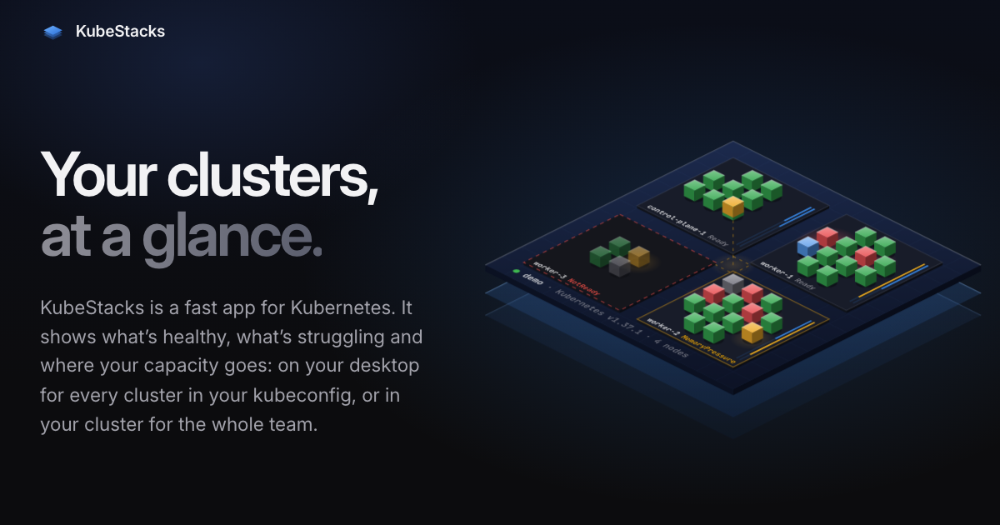

<div align="center">


# kubestacks.com

The website for [KubeStacks](https://github.com/KubeStacks/KubeStacks), a Kubernetes app for the desktop.

[](LICENSE)

</div>

[](https://kubestacks.com)

A static site built with [Astro](https://astro.build), with no UI framework on the page. The
hero's cluster is a canvas, and the feature tiles are small scripts that rebuild pieces of
the app's UI from the app's demo cluster: a command palette you can search, logs that stream,
a scale dialog that shows its `kubectl`.

## Development

You need Node.js 26 (24 also works; see `.nvmrc`).

```sh
npm ci
npm run dev        # http://localhost:4321
npm run build      # the static site, in dist/
npm run preview    # serves dist/
```

| Command             | What it does                             |
| ------------------- | ---------------------------------------- |
| `npm run typecheck` | Type-checks the `.astro` and `.ts` files |
| `npm run lint`      | ESLint                                   |
| `npm run format`    | Prettier (`format:check` only checks)    |

## How it works

### Downloads

Download links always point at the latest GitHub release. The build reads it from GitHub's
API and writes direct links to each installer into the page (set `GITHUB_TOKEN` to avoid
GitHub's rate limit for anonymous requests). When the page loads, it asks GitHub again and
switches every link over if a newer release has been published since, so a release doesn't
need a redeploy. If GitHub can't be reached, the links go to the latest release's page.

The visitor's platform and chip pick the file: the hero offers that one `.dmg`, `.exe` or
AppImage, and the download section lists the rest. Files are matched by the names the app's
`electron-builder.yml` gives them (`KubeStacks-<version>-mac-arm64.dmg` and so on; see
[`src/lib/releases.ts`](src/lib/releases.ts)); if those names change, change the patterns
there too.

### Light and dark

The page follows the system's theme, or the one picked in the switch at the top (System,
Light or Dark, like the app's Appearance menu). A script in `<head>` applies it before the
first paint. Every color is a token in [`src/styles/global.css`](src/styles/global.css), with
the app's light values under `[data-theme='light']`; the hero's canvas has its own pair of
palettes in [`src/scripts/cluster/palette.ts`](src/scripts/cluster/palette.ts).

### Holding still

Nothing on the page moves the page. The live demos have fixed heights and opt out of scroll
anchoring (`overflow-anchor: none`), and rows that re-sort glide into place rather than jump.
The demos only run while on screen, and not at all with reduced motion.

## Where things are

```
src/
  pages/index.astro       The page, section by section
  layouts/Base.astro      <head> and the theme script that runs before the first paint
  components/             One file per section, top to bottom:
    Hero.astro              Headline and the live cluster
    Showcase.astro          The app window with real screenshots (G, then a letter)
    Features.astro          Six tiles, each with a working piece of the UI (features/)
    More.astro              Custom resources and views, and the smaller features
    Themes.astro            Light and dark, side by side
    Story.astro             Why KubeStacks exists, and Sevalla
    Download.astro          Platforms, building from source, requirements
    logos/                  KubeStacks, GitHub and Sevalla marks
  scripts/                Each section's behavior, mounted on its data-* attribute
    cluster/                The hero: data, geometry, palettes and the renderer
    features/               The feature tiles
    downloads.ts            Picks the visitor's file, and checks for a newer release
    theme.ts                The theme switch
  lib/                    Shared by the build and the page
    releases.ts             The latest release and which file each platform gets
    icons.ts                Lucide icons (the app's set) as SVG strings, and the status pill
    site.ts                 Links to the repository, author and Sevalla
  styles/global.css       The app's tokens, type scale and shared pieces
  assets/screenshots/     The app's screenshots, dark and light
```

The design follows the app: its tokens, Inter and JetBrains Mono, Lucide icons, the status
pill and colors, and the same demo cluster (`checkout-jzhdh6j29h-hqnnn` crash-loops here
too). The screenshots come from the app's own script, which captures every view in both
themes: run `npm run build && node scripts/screenshots.ts <folder>` in the app's repository
and copy the `overview`, `workloads`, `bulk`, `metrics`, `logs`, `shell` and `helm` pairs into
`src/assets/screenshots`.

## Deploying

`npm run build` writes a plain static site to `dist/`, and any static host works. The site
is hosted on [Sevalla](https://sevalla.com) as a static site, with `npm run build` as the
build command and `dist` as the publish directory. `site` in
[`astro.config.ts`](astro.config.ts) builds the canonical and social-preview links.

## Credits

- [Lucide](https://lucide.dev) icons (ISC License)
- [Inter](https://rsms.me/inter/) and [JetBrains Mono](https://www.jetbrains.com/lp/mono/),
  via Fontsource (SIL Open Font License 1.1)
- The GitHub mark is GitHub's, and the Sevalla logo is Sevalla's; both are their trademarks,
  used here to link to them.

## License

The code is under the [Apache License 2.0](LICENSE), like the app.
